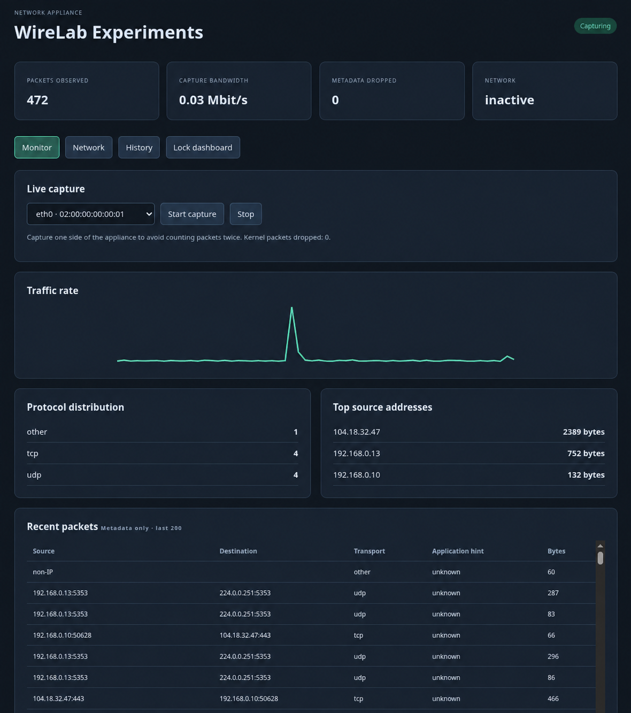

# WireLab Experiments

**Status: Work in progress.** Features and interfaces are still being developed
and tested.

A Linux C++23 network appliance for packet capture, traffic monitoring, and routed
IPv4 identity translation. Includes a local Vue dashboard, authenticated
REST/WebSocket API, SQLite history, and Netlink/nftables network control.

The executable and service are named `magicboxd`. Existing `magicbox` storage
paths and network resource names are retained for compatibility.



*Screenshot edited to replace the interface name and MAC address with example values.*

## Build and test

Requires Linux, CMake 3.20+, and a C++23 compiler (tested with GCC 14).
On Debian 13:

```sh
sudo apt-get update
sudo apt-get install build-essential cmake python3 libdrogon-dev libjsoncpp-dev libpcap-dev libsqlite3-dev libmnl-dev nftables iproute2
cmake -S . -B build -DCMAKE_BUILD_TYPE=Release
cmake --build build -j2
ctest --test-dir build --output-on-failure
```

Unit tests run without root or physical interfaces. The dashboard is bundled;
Node.js and external CDN access are not required.

Optional integration tests use disposable interfaces in an isolated network
namespace and take about 80 seconds:

```sh
sudo apt-get install python3-websocket iputils-ping
sudo unshare --net python3 tests/integration.py
```

The script requires a namespace containing only loopback. It covers authentication,
WebSockets, capture, history, NAT, MAC/VLAN changes, and rollback.

## Run locally

```sh
umask 077
magicbox_run_dir=$(mktemp -d)
python3 -c 'import secrets; print(secrets.token_hex(32))' > "$magicbox_run_dir/token"
cat "$magicbox_run_dir/token"
sudo ./build/magicboxd --token-file "$magicbox_run_dir/token" --database "$magicbox_run_dir/magicbox.sqlite" --web-root "$PWD/web"
```

Keep the daemon running in this terminal. Open `http://127.0.0.1:8080`, enter
the printed token, select an interface, and click
**Start capture**. The dashboard shows packet metadata, traffic rates, protocol
counts, capture losses, top talkers, and historical summaries.

This example stores data in a temporary directory; use the service installation
below for persistent storage.

Use `--help` for all options or `--capture <interface>` to capture on startup.
The selected interface persists across restarts. Capture only one appliance port
when measuring total traffic to avoid counting packets twice.

## Install as a service

On the appliance, from the built repository:

```sh
sudo sh deploy/install.sh
sudo systemctl enable --now magicboxd
sudo systemctl status magicboxd
sudo cat /etc/magicbox/token
```

Installation preserves existing tokens and data. The service listens on loopback
port 8080, permits capture, and leaves network changes disabled. Select an interface
in the dashboard to start capture on a fresh installation. Configuration and
history are stored in `/var/lib/magicbox/magicbox.sqlite`.

For remote access, run this on your workstation, replacing `user` and
`appliance-host` with your SSH account and host:

```sh
ssh -L 8080:127.0.0.1:8080 user@appliance-host
```

Open `http://127.0.0.1:8080` locally and use the token from the appliance.
Use an SSH tunnel or TLS reverse proxy for remote access; the embedded server
serves plain HTTP.

## Enable inline translation

The supported topology is routed IPv4. Example addresses:

```text
Protected device: 10.0.0.5/24, gateway 10.0.0.1
  -> Inner port: 10.0.0.1/24
  -> Linux forwarding + bidirectional NAT
  -> Outer port: 192.168.50.99/24, custom MAC, optional VLAN
  -> Upstream gateway: 192.168.50.1
```

Choose two dedicated Ethernet ports with no assigned IPv4/IPv6 addresses or
bridge/bond membership. Keep management access on a separate interface or use a
local console. Configure the upstream VLAN if needed and choose an available
outer IP/MAC. Use the actual interface names shown in the dashboard.

Run `sudo systemctl edit magicboxd` and add:

```ini
[Service]
ExecStart=
ExecStart=/usr/local/bin/magicboxd --token-file /etc/magicbox/token --database /var/lib/magicbox/magicbox.sqlite --web-root /usr/local/share/magicbox/web --allow-network
```

Restart with `sudo systemctl restart magicboxd`. In **Network**, enter the port
names and network identities, validate, apply, and verify connectivity. Confirm
within **60 seconds**, or the daemon rolls back. Before applying a replacement,
select **Rollback / deactivate**; this interrupts existing sessions.

Confirmed configuration remains active on normal shutdown and is reapplied on
restart with `--allow-network`. Unconfirmed changes are rolled back during recovery only when network control
is enabled with `--allow-network`. Starting without `--allow-network` leaves networking unchanged. Forwarding and
reverse-path filtering settings affect the whole host, so use a dedicated appliance
or isolated network namespace. Only one controller may run per network namespace.

Reserved resources: nftables tables `ip magicbox` and `inet magicbox`, route table
4242, policy-rule priority 10424, connection mark `0x4d425800`, and VLAN interface
`mbx-outer`. Do not reuse these identifiers. Rollback removes transaction resources
and restores saved port settings and sysctls.

## Scope and limitations

- Capture supports Ethernet, up to two VLAN tags, IPv4/basic IPv6, TCP/UDP/ICMP,
  and packet-local HTTP/DNS/TLS hints. Full Wireshark dissection, TCP reassembly,
  and TLS decryption are not implemented. Packet payloads are not persisted.
- Translation supports routed IPv4, custom outer MACs, and optional VLANs.
  Transparent bridging and DHCP are not implemented; the protected device must
  use the inner gateway. IPv6 forwarding on appliance ports is disabled.
  Identity translation does not guarantee anonymity.
- Capture uses an 8192-record queue and reports losses. The live list holds
  200 records. History retains seven days and up to 10,000 directed flow summaries;
  history queries return at most 1000 buckets and flow queries return the latest 200.
- Kernel forwarding runs independently of capture. Telemetry can fall behind under
  load; lossless capture and hardware throughput are not guaranteed.
- Existing firewall rules may block forwarding. Keep other network managers off
  the dedicated ports. Resolve storage or rollback errors shown in `/api/v1/status`
  before further changes.

See the [API reference](docs/api.md) and [architecture](docs/architecture.md)
for implementation details. Namespace integration tests do not verify physical NIC behavior or throughput.

Much of the initial implementation was AI-generated. Review and validation are ongoing.
This project is intended for educational use and experimentation.
